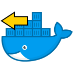

# docker-portmap-client



[](https://hub.docker.com/r/dmotte/portmap-client)

This is a :whale: **Docker image** you can use to expose a **local TCP port** to the internet using an **SSH tunnel**.

It works by connecting to a (publicly exposed) SSH server; this can be for example an instance of the **[dmotte/portmap-server](https://github.com/dmotte/docker-portmap-server.git) image** or an online **SSH tunneling service** like [portmap.io](https://portmap.io/)

> :package: This image is also on **Docker Hub** as [`dmotte/portmap-client`](https://hub.docker.com/r/dmotte/portmap-client) and runs on **several architectures** (e.g. amd64, arm64, ...). To see the full list of supported platforms, please refer to the `.github/workflows/docker.yml` file.

## Usage

> **Note**: TODO we assume an SSH server like portmap-server is already available or online service like portmap.io that have given the private key

Important:
chmod 600 vols-portmap-client/ssh_client_key

TODO envvars list, all required except SSH_USERNAME=portmap, SSH_PORT=22

To try this image you just have to:

1. Install **Docker** and **Docker-Compose** on your machine
2. Clone this repo
   ```bash
   git clone https://github.com/dmotte/docker-portmap-client.git
   ```
3. TODO put key
4. TODO known_hosts
   ```bash
   ssh-keyscan -p 2222 10.0.2.15 > "vols-portmap-client/known_hosts"
   ```
3. Inside that folder, run the following command:
   ```bash
   docker-compose up -d
   ```

TODO now check the local port and now check the public one TODO screenshot

TODO If you want to see the logs

```bash
docker-compose logs -ft
```

## Development

TODO

```bash
docker-compose up --build
```
